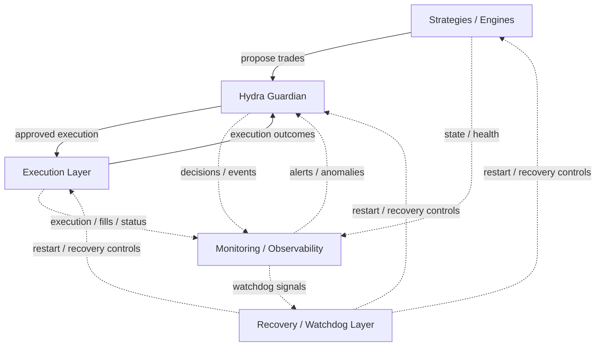

# Hydra Core

**Status:** Pre-v1 governance and architecture repository.

Hydra Core documents a governed, risk-first trading infrastructure.
It describes how enforcement, observability, and fail-closed operations are expected to work across the Hydra system.

Losses are expected. Escalation is not.

## Repository Scope

Hydra is described publicly as three related parts:

- **Hydra Core**: public architecture, doctrine, governance, and operating principles
- **Hydra Quant**: private strategy and execution systems operating within those constraints
- **Hydra Guardian**: private supervisory and enforcement layer behind Hydra Quant, responsible for veto, disarm, and recovery decisions

This repository is `hydra-core` only.
It does not publish private implementation code from Hydra Quant or Hydra Guardian.

## Operating Position

Hydra is designed around a simple assumption:

> If a rule can be broken, it eventually will be.

That assumption drives a system model in which:

- risk is enforced at the system boundary, not left to operator discretion
- ambiguous state is treated as unsafe until proven otherwise
- observability is part of control, not an afterthought
- recovery requires verification rather than optimism

The goal is not uninterrupted activity.
The goal is controlled survivability under loss, latency, ambiguity, and operator error.

## High-Level Architecture

This diagram is conceptual.
It shows supervisory relationships around the system, not private implementation details.

## Core Principles

- **Risk First**: exposure is constrained before execution is allowed
- **Fail Closed**: uncertainty, stale state, or invalid constraints lead to rejection or disarm
- **Engine Isolation**: local failures should remain local unless supervisory policy escalates them
- **Observability**: enforcement decisions must leave enough evidence to reconstruct what happened
- **No Escalation**: losses do not justify larger size, looser rules, or bypassed controls

## Start Here

- [Docs Map](docs-map.md): recommended reading order for the public governance surface
- [System Overview](architecture/system-overview.md): high-level public architecture and control boundaries
- [Control Boundaries](architecture/control-boundaries.md): responsibilities and authority lines between engines, Guardian, execution, monitoring, and recovery
- [State Model](architecture/state-model.md): public-safe operating states and their fail-closed meaning
- [Hydra Guardian](architecture/hydra-guardian.md): the named supervisory and enforcement layer behind Hydra Quant
- [Risk Doctrine](doctrine/risk-doctrine.md): core operating principles for risk, disarm, and fail-closed behavior
- [Why Most Bots Fail](doctrine/why-most-bots-fail.md): strategy-agnostic doctrine on survivability and structural failure

## Documentation Map

- [Docs Map](docs-map.md)
- [System Overview](architecture/system-overview.md)
- [Control Boundaries](architecture/control-boundaries.md)
- [State Model](architecture/state-model.md)
- [Hydra Guardian](architecture/hydra-guardian.md)
- [Glossary](glossary.md)
- [Risk Doctrine](doctrine/risk-doctrine.md)
- [Why Most Bots Fail](doctrine/why-most-bots-fail.md)
- [Operating Principles](operations/operating-principles.md)
- [Operator Runbook](operations/operator-runbook.md)
- [Failure Modes](governance/failure-modes.md)
- [Release Posture](governance/release-posture.md)
- [Versioning Policy](governance/versioning-policy.md)
- [Risk Event Ledger](governance/risk-event-ledger.md)
- [Risk Event Ledger Policy](governance/risk-event-ledger-policy.md)

For edits that change governance meaning, enforcement expectations, or recovery semantics, review the change classification guidance in [Versioning Policy](governance/versioning-policy.md) before updating the ledger.

## Status

Hydra Core remains pre-v1.

This repository is intended to stabilize public doctrine and governance before any later v1 release decision.
It should be read as architecture and operating policy, not as a public software distribution.
