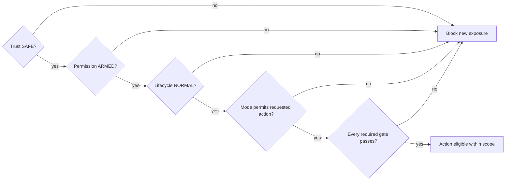

# Multi-Axis State Model

Hydra state is a scoped tuple of independent axes:

`trust × permission × lifecycle × operating mode`

The axes must be recorded independently for the named scope. Combining them into a single green/red label hides contradictions and can accidentally expand authority.

> **Execution is eligible only when trust is `SAFE`, permission is `ARMED`, lifecycle is `NORMAL`, the configured operating mode permits execution, and every required gate passes.**

Eligibility is not an instruction to trade, proof of edge, or public-user authorization.

## Trust Axis

Trust describes whether the required control state is coherent enough for the scoped action.

| Value | Definition | Effect on new exposure |
| --- | --- | --- |
| `SAFE` | Required state, observability, and enforcement preconditions are coherent for the named scope at the stated time. | Does not block by trust alone; every other axis and gate still applies. |
| `DEGRADED` | A known impairment reduces trust or narrows valid behavior, even if some observation remains reliable. | Blocked, except an explicitly defined containment action. |
| `AMBIGUOUS` | State is missing, stale, contradictory, incomplete, or cannot be reconciled authoritatively. | Blocked; reconcile before restoration. |
| `UNSAFE` | A known condition makes continued new exposure unacceptable or shows a material control-boundary failure. | Blocked; contain and enter governed recovery as required. |

`SAFE` does not imply profitability, positive expectancy, zero risk, evidence quality, or permission.

## Permission Axis

Permission describes whether the named authority has conditionally allowed actions inside a defined scope and mode.

| Value | Definition | Effect |
| --- | --- | --- |
| `ARMED` | Conditional permission is present for the named scope and configured mode if every other gate passes. | May allow only the actions already permitted by mode and higher-layer state. |
| `DISARMED` | Permission has been withdrawn or cannot be proved. | Blocks new exposure and any silent resumption. |

`ARMED` is never an instruction to trade. `ARMED` in `SHADOW` authorizes shadow processing only. It never authorizes live order submission.

Internal permission and public-user permission are separate scopes. One cannot be inferred from the other.

## Lifecycle Axis

Lifecycle describes whether normal operation or explicit recovery discipline applies.

| Value | Definition | Effect |
| --- | --- | --- |
| `NORMAL` | No unresolved recovery condition is recorded for the scope. | Does not block by lifecycle alone. |
| `RECOVERY_REQUIRED` | Reconciliation, repair, validation, or authority review must complete before normal operation can be restored. | Blocks automatic rearm and new exposure. |

Restart, restored process health, operator confidence, and elapsed time cannot clear `RECOVERY_REQUIRED`. Clearing recovery and granting `ARMED` are separate decisions.

## Operating Mode

Operating mode defines the environment and action class. It is not a trust or permission value.

| Value | Definition | Order-submission boundary |
| --- | --- | --- |
| `OBSERVE_ONLY` | Collect and display permitted observations and diagnostics without generating executable activity. | No order submission. |
| `SHADOW` | Process current inputs and record hypothetical decisions prospectively without sending orders. | No order submission to demo or live destinations. |
| `DEMO` | Permit eligible orders only to an explicitly segregated demo or simulation domain. | Demo-domain orders only; no live route. |
| `LIVE` | Permit eligible live-domain orders only within explicitly governed private authority. | Live-domain orders may be eligible; public-user authority is still separate. |

Mode describes what kind of action could be eligible. It never proves that the other axes or required gates pass. The current public-user mode is defined only in the dated [Public Operating Posture](../status/public-operating-posture.md).

## Gate Evaluation

Observation and diagnostics may remain available while execution is blocked, provided they do not weaken containment or disclose protected information.

## Precedence And Aggregation

Higher or stricter layers can narrow lower-layer authority. Lower layers cannot override a stricter higher-layer state.

### Trust Precedence

When multiple authoritative trust values apply to the same action, the most restrictive controls:

`UNSAFE` > `AMBIGUOUS` > `DEGRADED` > `SAFE`

### Other Axes

- `DISARMED` controls over `ARMED`.
- `RECOVERY_REQUIRED` controls over `NORMAL`.
- Mode conflict resolves to the intersection of permitted actions, never to a broader mode.
- If no common permitted action can be proved, effective order execution is blocked.
- A public-user restriction cannot be relaxed by an internal engine state.

Contradiction always resolves toward the more restrictive posture while the contradiction is investigated.

## Missing Or Stale State

Missing state fails closed:

| Missing value | Effective treatment |
| --- | --- |
| Trust | `AMBIGUOUS` |
| Permission | `DISARMED` |
| Lifecycle | `RECOVERY_REQUIRED` |
| Mode | Execution blocked; expose an effective `OBSERVE_ONLY` posture until authoritative mode is restored |

Expired state is missing state. Consumers must not extend a time-to-live silently or reuse a last-known permissive value as current.

## Allowed Transition Principles

- Any authoritative layer may immediately narrow trust, disarm its scope, or require recovery when its policy permits.
- A scope may move toward observation or containment without waiting for normal promotion review.
- Trust restoration requires current authoritative evidence for every affected dependency.
- `RECOVERY_REQUIRED` may become `NORMAL` only after the recorded recovery conditions are satisfied and verified by the proper authority.
- `DISARMED` may become `ARMED` only through a separate explicit rearm decision after lifecycle normalization and gate validation.
- Mode promotion requires explicit governance review, evidence classification, authority boundaries, and negative testing.
- Mode demotion may occur immediately to contain risk or preserve evidence integrity.

## Prohibited Transitions

- automatic `RECOVERY_REQUIRED` → `NORMAL`
- automatic `DISARMED` → `ARMED`
- restart or elapsed-time-based recovery or rearm
- result-triggered mode promotion
- relabelling `SHADOW` as `LIVE` without a governed promotion event
- lower-layer override of a higher-layer restriction
- inference of `SAFE`, `ARMED`, or `NORMAL` from silence or process health
- inference of strategy edge from runner health or `LIVE_READY`
- inference of public-user permission from private operational permission

## Recovery Conditions

Recovery conditions are event-specific and must be recorded before normal operation is considered. At minimum, recovery must address:

- the triggering cause and affected scope
- authoritative exposure, order, and intent reconciliation where applicable
- restoration of fresh, coherent control state
- validation of enforcement and containment controls
- evidence preservation and any required correction
- unresolved residual risk
- the authority permitted to clear the lifecycle condition

A containment action may cancel, close, or reduce exposure only when explicitly defined for the failure class. It must not be used to introduce or enlarge exposure.

## Rearm Conditions

Rearm requires all of the following for the named scope:

- lifecycle is already `NORMAL`
- trust is demonstrably `SAFE`
- the configured mode and destination are verified
- required gates pass on current state
- no stricter higher-layer disarm applies
- the authorized rearm decision and its evidence are recorded

Rearm restores conditional permission only. It does not authorize a particular trade, prove edge, change public-user access, or promote operating mode.

Related documents:

- [Control Boundaries](control-boundaries.md)
- [Hydra Guardian](hydra-guardian.md)
- [Operator Runbook](../operations/operator-runbook.md)
- [Failure Modes](../governance/failure-modes.md)
